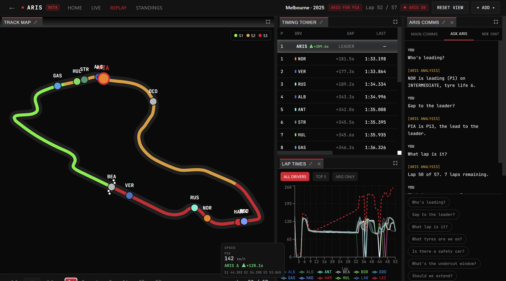
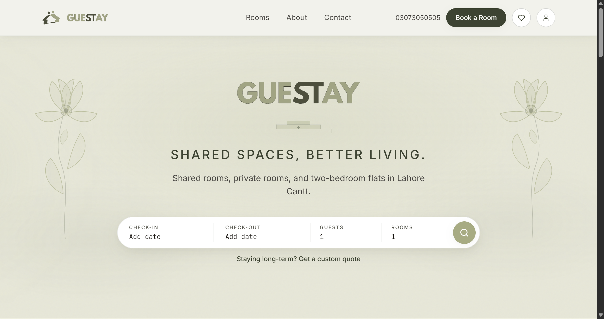

<!-- ══════════════════════════════════════════════════════════════
     MUHAMMAD ANAS NADEEM · PROFILE README
     Repo structure required:
       README.md
       assets/header.svg
       assets/race-strip.svg
       assets/timing.svg
       assets/aris-screenshot.png
       assets/guestay-screenshot.png
     ══════════════════════════════════════════════════════════════ -->


<br/>

<div align="center">

**📍 London, UK &nbsp;&middot;&nbsp; BSc Computer Science @ Brunel University London**

**🎯 Open to Placement 2027 — Software Engineering · Data Engineering · F1 Technical Roles**

</div>

<br/>

---

## `// 01` &nbsp; TOP SKILLS

<div align="center">

**Languages**


<br/>

**Backend & Data**


<br/>

**Frontend**


<br/>

**Infrastructure & DevOps**


</div>

<br/>

---

## `// 02` &nbsp; PROJECTS

<table width="100%">
<tr>
<td width="38%" style="background-color:#0D0D0D;padding:0;border:1px solid #1E1E1E;">
<a href="https://arisf1.tech"></a>
</td>
<td style="background-color:#0D0D0D;padding:20px 24px;border:1px solid #1E1E1E;vertical-align:top;">
<b style="font-size:15px;">ARIS &middot; F1 Race Strategy Engine</b>
<br/><br/>
A full replay pit-wall for F1 (2024–2026) with live timing tower, track map, and a search-based strategy engine that scores every pit/stay decision using a physics lap-time model — then races a ghost driver against the real one in parallel. Includes a reactive analytics suite and an Ask ARIS Q&A copilot.
<br/><br/>
<sub style="color:#888884;">Python · FastAPI · PostgreSQL · Next.js · FastF1 · Cloudflare · Heroku</sub>
<br/><br/>
<sub style="color:#555;">Dry decision match-rate: 30/87 vs a 24/87 never-pit baseline.</sub>
<br/><br/>
🔗 <a href="https://arisf1.tech">arisf1.tech</a> &nbsp;&middot;&nbsp; 📦 <a href="https://github.com/AnassNadeem/ARIS">Repo</a>
</td>
</tr>

<tr><td colspan="2" style="padding:0;border:none;height:12px;background:transparent;"></td></tr>

<tr>
<td width="38%" style="background-color:#0D0D0D;padding:0;border:1px solid #1E1E1E;">
<a href="https://guestay.pk"></a>
</td>
<td style="background-color:#0D0D0D;padding:20px 24px;border:1px solid #1E1E1E;vertical-align:top;">
<b style="font-size:15px;">Guestay &middot; Property Booking Platform</b>
<br/><br/>
A production CRM and booking platform for short-term property rentals — guest management, availability, bookings, and admin tooling. Built and deployed for a real business.
<br/><br/>
<sub style="color:#888884;">Next.js · PostgreSQL · TypeScript · Tailwind CSS</sub>
<br/><br/>
🔗 <a href="https://guestay.pk">guestay.pk</a>
</td>
</tr>
</table>

<br/>

---

## `// 03` &nbsp; RESEARCH

<table width="100%">
<tr>
<td style="background-color:#0D0D0D;padding:20px 24px;border:1px solid #1E1E1E;">
<b style="font-size:15px;">BOXBOX &middot; Can Frontier LLMs Call an F1 Race?</b>
<br/><br/>
A contamination-resistant benchmark testing whether large language models can make Formula 1 pit-stop strategy decisions. 11 races, 196 decision points, 5 frontier models — every call scored against an ex-ante optimal strategy from a calibrated race simulator. The 2026 test set postdates all models' training data by construction. Findings: every model falls well short of the human pit wall, model price does not predict decision quality, and accuracy diverges sharply from self-consistency.
<br/><br/>
<sub style="color:#888884;">Preregistered · Code, data, and full paper public</sub>
<br/><br/>
📄 <a href="https://github.com/AnassNadeem/BoxBox">Read on GitHub</a> &nbsp;&middot;&nbsp; 🔬 <a href="https://doi.org/10.5281/zenodo.22087206">DOI: 10.5281/zenodo.22087206</a>
</td>
</tr>
</table>

<br/>

---

## `// 04` &nbsp; COMPETITION RECORD

<table width="100%">
<tr>
<td width="52" align="center" style="background-color:#0D0D0D;padding:20px 12px;border:1px solid #1E1E1E;">
<b style="color:#E8002D;font-size:20px;font-family:monospace;">01</b>
</td>
<td style="background-color:#0D0D0D;padding:16px 20px;border:1px solid #1E1E1E;">
<b>Oxford Physical AI Hackathon</b><br/>
<sub style="color:#888884;">Oxford AI Society &nbsp;&middot;&nbsp; Track 2 &nbsp;&middot;&nbsp; SO-101 + Amazing Hands &nbsp;&middot;&nbsp; Neuracore Stack</sub>
<br/><br/>
Only team to assemble the Amazing Hand hardware end-to-end. Shipped three live demos in 24 hours — real-time hand mirroring via imitation learning, sign language recognition, and a Meta Quest VR control interface.
</td>
</tr>
<tr>
<td width="52" align="center" style="background-color:#0D0D0D;padding:20px 12px;border:1px solid #1E1E1E;">
<b style="color:#E8002D;font-size:20px;font-family:monospace;">02</b>
</td>
<td style="background-color:#0D0D0D;padding:16px 20px;border:1px solid #1E1E1E;">
<b>Patient Continuity in Crisis Zones</b><br/>
<sub style="color:#888884;">Imperial College London &nbsp;&middot;&nbsp; Crisis Zones Hackathon</sub>
<br/><br/>
Built a centralised hospital system for conflict regions with biometric patient matching via face-to-vector embeddings — no raw image storage. Offline-first architecture with local caching for degraded and unstable networks.
</td>
</tr>
<tr>
<td width="52" align="center" style="background-color:#0D0D0D;padding:20px 12px;border:1px solid #1E1E1E;">
<b style="color:#E8002D;font-size:20px;font-family:monospace;">03</b>
</td>
<td style="background-color:#0D0D0D;padding:16px 20px;border:1px solid #1E1E1E;">
<b><a href="https://github.com/alvisk/encode-spoonOS">AssertionOS</a></b><br/>
<sub style="color:#888884;">Encode &nbsp;&middot;&nbsp; SpoonOS Hackathon</sub>
<br/><br/>
AI-powered multi-chain wallet security agent with real-time threat detection for DeFi. Built the on-chain reasoning module and tool-use integration layer.
</td>
</tr>
</table>

<br/>

---

## `// 05` &nbsp; EXPERIENCE

```
Jan 2026 – Mar 2026   Student Leader · Electech Lab
                      Taught robotics, logic gates, and coding to primary-school
                      students at St Andrews C of E using Tinkercad + Code Monkey.

Jul 2024 – Aug 2024   PHP Intern · Tally Marks Consulting
                      Optimised database operations and wrote complex SQL queries
                      for enterprise data management systems.
```

---

## `// 06` &nbsp; STATUS

```python
status = {
    "degree"    : "BSc Computer Science · Brunel University London",
    "building"  : "ARIS — F1 race strategy engine  (physics search + ghost simulation)",
    "open_to"   : ["placements 2027", "software engineering", "data engineering", "F1 technical roles"]
}
```

---

<div align="center">

[](https://linkedin.com/in/MuhammadAnasNadeem)
&nbsp;
[](mailto:anass.nadeem42@gmail.com)
&nbsp;
[](https://anasnadeem.dev)
&nbsp;
[](https://github.com/AnassNadeem/ARIS)

</div>


