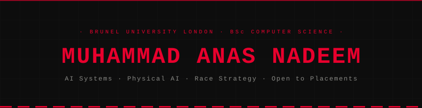

<!-- ══════════════════════════════════════════════════════════════
     MUHAMMAD ANAS NADEEM · PROFILE README
     Repo structure required:
       README.md
       assets/header.svg
       assets/race-strip.svg
       assets/timing.svg
     ══════════════════════════════════════════════════════════════ -->




<br/>
<br/>

---

## `// 01` &nbsp; COMPETITION RECORD

<table width="100%">
<tr>
<td width="52" align="center" style="background-color:#0D0D0D;padding:20px 12px;border:1px solid #1E1E1E;">
<b style="color:#E8002D;font-size:20px;font-family:monospace;">01</b>
</td>
<td style="background-color:#0D0D0D;padding:16px 20px;border:1px solid #1E1E1E;">
<b>Oxford Physical AI Hackathon</b><br/>
<sub style="color:#888884;">Oxford AI Society &nbsp;&middot;&nbsp; Track 2 &nbsp;&middot;&nbsp; SO-101 + Amazing Hands &nbsp;&middot;&nbsp; Neuracore Stack</sub>
<br/><br/>
Only team to assemble the Amazing Hand hardware end-to-end. Shipped three live demos in 24 hours — real-time hand mirroring via imitation learning, sign language recognition, and a Meta Quest VR control interface.
</td>
</tr>
<tr>
<td width="52" align="center" style="background-color:#0D0D0D;padding:20px 12px;border:1px solid #1E1E1E;">
<b style="color:#E8002D;font-size:20px;font-family:monospace;">02</b>
</td>
<td style="background-color:#0D0D0D;padding:16px 20px;border:1px solid #1E1E1E;">
<b>Patient Continuity in Crisis Zones</b><br/>
<sub style="color:#888884;">Imperial College London &nbsp;&middot;&nbsp; Crisis Zones Hackathon</sub>
<br/><br/>
Built a centralised hospital system for conflict regions with biometric patient matching via face-to-vector embeddings — no raw image storage. Offline-first architecture with local caching for degraded and unstable networks.
</td>
</tr>
<tr>
<td width="52" align="center" style="background-color:#0D0D0D;padding:20px 12px;border:1px solid #1E1E1E;">
<b style="color:#E8002D;font-size:20px;font-family:monospace;">03</b>
</td>
<td style="background-color:#0D0D0D;padding:16px 20px;border:1px solid #1E1E1E;">
<b><a href="https://github.com/alvisk/encode-spoonOS">AssertionOS</a></b><br/>
<sub style="color:#888884;">Encode &nbsp;&middot;&nbsp; SpoonOS Hackathon</sub>
<br/><br/>
AI-powered multi-chain wallet security agent with real-time threat detection for DeFi. Built the on-chain reasoning module and tool-use integration layer.
</td>
</tr>
</table>

<br/>

---

## `// 02` &nbsp; CURRENT BUILD &middot; ARIS

> Adaptive Race Intelligence System — a physics-grounded, ML-augmented F1 strategy engine that evaluates pit decisions per tick using Monte Carlo confidence intervals and narrates the optimal call with a quantified lap-time delta.

```
PIPELINE ───────────────────────────────────────────────────────────────────
  FastF1 Ingest → PostgreSQL → Bicycle Model + Tyre Degradation + Fuel Burn
                                          ↓
                               XGBoost ML Residual
                                 (race-by-race CV)
                                          ↓
                       Monte Carlo Action-Search Engine
                              ↙                    ↘
             Strategy Output                   LLM Narration
         delta · CI · pit window            radio-call format
                              ↘                    ↙
                           Streamlit Dashboard
─────────────────────────────────────────────────────────────────────────────
```

| Phase | Scope | Status |
|---|---|:---:|
| 1 &middot; Foundations | FastF1 pipeline &middot; PostgreSQL &middot; Streamlit | ✅ |
| 2 &middot; Predictor | Bicycle model &middot; Tyre degradation &middot; XGBoost residual | 🔄 |
| 3 &middot; Counterfactuals | Perturbation engine &middot; Tiered tick architecture | ⏳ |
| 4 &middot; Narration | Local LLM &middot; Conformal calibration &middot; Strategy backtest | ⏳ |

&rarr;&nbsp; [Execution Plan](https://github.com/AnassNadeem/ARIS/blob/main/ARIS-EXECUTION-PLAN.md) &nbsp;&middot;&nbsp; [Build Log](https://github.com/AnassNadeem/ARIS/blob/main/BUILD-LOG.md) &nbsp;&middot;&nbsp; [Repository](https://github.com/AnassNadeem/ARIS)

---

## `// 03` &nbsp; TECH STACK

<div align="center">

**Languages**


<br/>

**AI &middot; ML &middot; Simulation**


<br/>

**Infrastructure &middot; DevOps**


<br/>

**Physical AI &middot; Hardware**


</div>

---

## `// 04` &nbsp; EXPERIENCE

```
Jan 2026 – Mar 2026   Student Leader · Electech Lab
                      Taught robotics, logic gates, and coding to primary-school
                      students at St Andrews C of E using Tinkercad + Code Monkey.

Jul 2024 – Aug 2024   PHP Intern · Tally Marks Consulting
                      Optimised database operations and wrote complex SQL queries
                      for enterprise data management systems.
```

---

## `// 05` &nbsp; STATUS

```python
status = {
    "degree"    : "BSc Computer Science · Brunel University London",
    "building"  : "ARIS — F1 race strategy AI  (physics + ML + LLM narration)",
    "studying"  : ["ML theory", "vehicle dynamics", "conformal prediction"],
    "exploring" : ["VLA models", "imitation learning", "physical AI systems"],
    "open_to"   : ["placements", "internships", "AI/ML · robotics · software engineering"]
}
```

---

<div align="center">

[](https://linkedin.com/in/MuhammadAnasNadeem)
&nbsp;
[](mailto:anass.nadeem42@gmail.com)
&nbsp;
[](https://github.com/AnassNadeem/ARIS)
&nbsp;
[](https://github.com/AnassNadeem)

</div>


